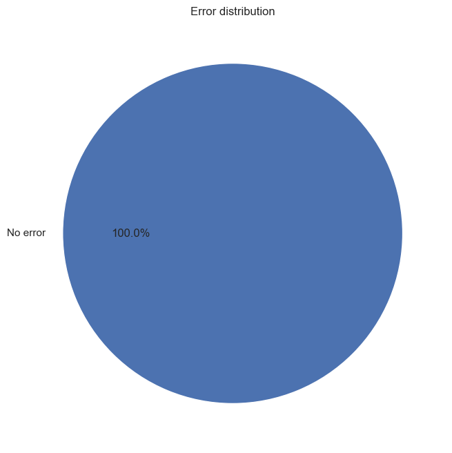
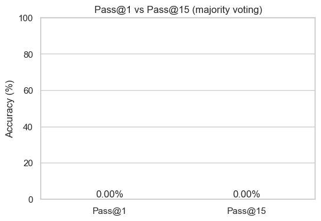

# Sprint 4 — Final Report (Draft)

## Title

AIMO Kaggle Project — Sprint 4

## Abstract

Báo cáo này tóm tắt thiết kế hệ thống, cơ sở lý thuyết, triển khai Program-of-Thought (PoT) để giải bài toán toán học dạng AIME bằng LLM kết hợp sandboxed execution, phân tích lỗi, và kết quả đánh giá.

---

## Table of Contents

1. Introduction
2. Related Work
3. LLM limitations for Mathematics
4. Program-of-Thought approach
5. System Architecture and Rationale
6. Implementation Details
7. KV Cache and vLLM considerations
8. Evaluation Methodology
9. Results and Error Analysis
10. Case Studies
11. Recommendations and Future Work
12. Appendix (prompts, sample outputs, scripts)

---

## 1. Introduction

(Use `docs/report_outline.md` for structure and expand here.)

## 2. Related Work

(Summarize prior PoT / chain-of-thought literature briefly.)

## 3. LLM limitations for Mathematics

(From `docs/sprint4_theory.md`)

- Sự không nhất quán số học.
- Thiếu khả năng thực thi tính toán nội tại.
- Hallucination và lỗi bước trung gian.

## 4. Program-of-Thought (PoT)

- Ý tưởng: yêu cầu LLM sinh mã (Python) mô tả bước tính.
- Lợi ích: tính toán deterministic, dễ kiểm chứng, cho phép majority voting.
- Rủi ro & mitigations: sandbox, timeout, parser robustness.

## 5. System Architecture and Rationale

- Mô tả pipeline tổng quát: Input → Prompt Template → LLM → Parser → Extracted Code / Raw Fallback → Sandboxed Executor → Normalizer → Evaluation & Voting → Report/Submission.

### Pipeline diagram

See file: docs/pipeline_diagram.mmd

Rationale:

- PoT + sandbox execution để tăng độ chính xác và minh bạch.
- Hỗ trợ nhiều engine (OpenAI / Google / vLLM) để linh hoạt và tận dụng KV cache.
- Kết hợp raw numeric fallback và majority voting để tăng robustness.

## 6. Implementation Details

- `src/parser.py`: code extraction, `extract_numeric_answer` fallback.
- `src/executor.py`: `PythonExecutor` with stdout capture, timeout handling.
- `scripts/evaluate.py`: evaluation loop, records `prediction_method` and `is_correct`.
- `scripts/sprint4_analysis.py`: tạo biểu đồ và trích ví dụ case study.

## 7. KV Cache and vLLM considerations

(From theory file — KV cache giảm chi phí cho nhiều lần inference với cùng context.)

## 8. Evaluation Methodology

Metrics used:

- Pass@1 (single-shot correctness)
- Pass@k / Majority voting (aggregate correctness across multiple predictions)
- Error taxonomy: Timeout, ExecutionError, ParseError, WrongResult, NoPrediction

Data:

- `data/evaluation_report.csv` — recorded fields: id, problem, true_answer, predicted_answer, prediction_method, is_correct, error_log

## 9. Results and Error Analysis

### Summary statistics

(Include aggregated numbers — to be filled from analysis outputs.)

### Error distribution

Include generated image: outputs/error_pie.png



### Accuracy comparison

Include generated image: outputs/accuracy_comparison.png



## 10. Case Studies

(From `docs/case_studies.md`)

<!-- Insert case studies content -->

```
<!-- Auto-generated case studies file: docs/case_studies.md -->
```

Include 2–3 highlighted examples where the model produced plausible code but an off-by-one or punctuation error led to wrong final answer.

## 11. Recommendations and Future Work

- Improve prompt templates to force explicit returned `result =` or `print()` statements.
- Expand parser to handle more LaTeX variants and fractional outputs.
- Use deterministic arithmetic engine for intermediate symbolic manipulation (SymPy) when needed.
- Explore micro-ensemble strategies and weighted voting.

## 12. Appendix

- Prompts (examples): see `scripts/` and `src/` prompt templates.
- How to reproduce analysis:

Run analysis script:

```bash
python scripts/sprint4_analysis.py --report data/evaluation_report.csv --out outputs
```

Convert markdown to PDF (suggestion):

```bash
pandoc docs/sprint4_report.md -o docs/sprint4_report.pdf --pdf-engine=xelatex --toc
```

---

End of draft.
